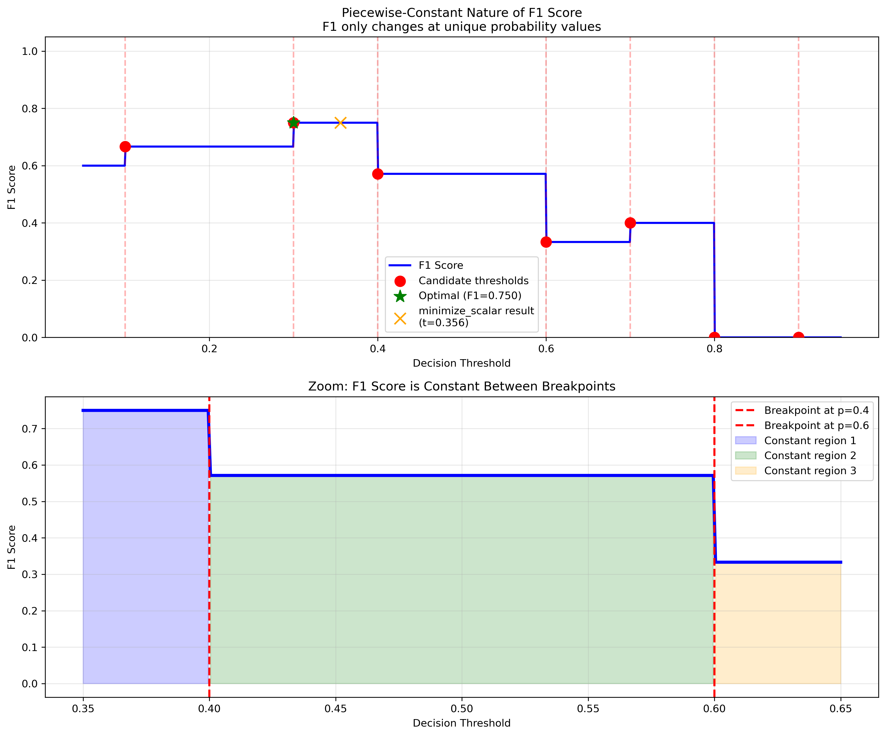

Optimal Classification Cutoffs
===============================

Optimize classification thresholds to improve model performance. The library provides efficient algorithms for threshold selection in binary and multiclass classification.

**Why Default 0.5 Thresholds Are Wrong:**

Most classifiers output probabilities, but decisions need thresholds. The default τ = 0.5 assumes equal costs and balanced classes. Real problems have imbalanced data (fraud: 1%, disease: 5%) and asymmetric costs (missing fraud costs $1000, false alarm costs $1).

**API 2.0.0 Features:**

* **🎯 Clean API** - 2 core functions, progressive disclosure design
* **⚡ Auto-selection** - intelligent algorithm + task detection with explanations
* **🚀 O(n log n) optimization** - exact solutions for piecewise metrics
* **💰 Cost-matrix decisions** - Bayes-optimal without thresholds
* **🔧 Namespaced power tools** - metrics/, cv/, bayes/, algorithms/
* **📊 Match/case routing** - Modern Python 3.10+ performance
* **API v2.0** - Redesigned architecture with modern patterns

.. toctree::
   :maxdepth: 2
   :caption: Getting Started

   installation
   quickstart

.. toctree::
   :maxdepth: 2
   :caption: User Guide

   user_guide
   examples
   advanced

.. toctree::
   :maxdepth: 2
   :caption: API Reference

   api/index

.. toctree::
   :maxdepth: 2
   :caption: Theory & Background

   theory

.. toctree::
   :maxdepth: 1
   :caption: Additional Resources

   faq

Why Optimize Classification Thresholds?
=======================================

Most classifiers use a default threshold of 0.5, but this is often suboptimal for:

🏥 **Medical Diagnosis**
   False negatives (missed diseases) cost far more than false positives

🏦 **Fraud Detection**
   Missing fraud has higher cost than investigating legitimate transactions

📧 **Spam Detection**
   Blocking legitimate emails is worse than letting some spam through

📊 **Imbalanced Datasets**
   Default thresholds perform poorly when classes have very different frequencies

The Problem with Standard Optimization
======================================

Classification metrics like F1 score are **piecewise-constant functions** that create challenges for traditional optimization methods:

Standard optimizers fail because these functions have:

* **Zero gradients** everywhere except at breakpoints
* **Flat regions** providing no directional information
* **Step discontinuities** that trap optimizers

Our solution uses specialized algorithms designed for piecewise-constant optimization.

Quick Example
=============

.. code-block:: python

   from optimal_cutoffs import optimize_thresholds
   import numpy as np
   from sklearn.ensemble import RandomForestClassifier
   from sklearn.model_selection import train_test_split
   from sklearn.datasets import make_classification

   # Generate imbalanced dataset
   X, y = make_classification(n_samples=1000, weights=[0.9, 0.1], random_state=42)
   X_train, X_test, y_train, y_test = train_test_split(X, y, test_size=0.3)

   # Train classifier
   clf = RandomForestClassifier().fit(X_train, y_train)
   y_prob = clf.predict_proba(X_test)[:, 1]

   # Find optimal threshold (automatic algorithm selection)
   result = optimize_thresholds(y_test, y_prob, metric='f1')
   threshold = result.thresholds[0]
   print(f"Optimal F1 threshold: {threshold:.3f}")

   # Compare with default 0.5 threshold
   default_pred = (y_prob >= 0.5).astype(int)
   optimal_pred = (y_prob >= threshold).astype(int)

   from sklearn.metrics import f1_score
   print(f"Default F1: {f1_score(y_test, default_pred):.3f}")
   print(f"Optimal F1: {f1_score(y_test, optimal_pred):.3f}")

Algorithm Performance
=====================

The library provides multiple optimization algorithms with different trade-offs:

**Available Methods:**

* **sort_scan**: O(n log n) exact algorithm for piecewise metrics - fastest for large datasets
* **minimize**: Uses scipy optimization with fallback to ensure global optimum
* **gradient**: Simple gradient ascent (baseline method)
* **auto** (default): Automatically selects the best method based on data characteristics

**Performance Characteristics:**

* The ``sort_scan`` method scales as O(n log n) where n is the number of samples
* For piecewise metrics (F1, accuracy, precision, recall), ``sort_scan`` guarantees the global optimum
* The ``auto`` method intelligently selects between algorithms based on metric properties
* All methods are tested to complete within reasonable time limits (see ``tests/performance/``)

Citation
========

If you use this library in academic research, please cite:

.. code-block:: bibtex

   @software{optimal_classification_cutoffs,
     author = {Laohaprapanon, Suriyan and Sood, Gaurav},
     title = {Optimal Classification Cutoffs: Fast algorithms for threshold optimization},
     url = {https://github.com/finite-sample/optimal-classification-cutoffs},
     year = {2024}
   }

Indices and Tables
==================

* :ref:`genindex`
* :ref:`modindex`
* :ref:`search`
